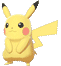
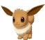

    
    <h1> Pokedex Tracker</h1>

 Welcome to the Pokedex Tracker Hub!

This set of pokedex trackers is your go-to companion for 5 of the 6 Nintendo Switch games.

Love this project? Show your love by dropping a  on this repo.

## Games included
<strong>Let's Go Pikachu⚡ Eevee🦊</strong> 
 
- 168 trackable pokémon
- 18 alolan pokémon

<strong>Sword🗡️ Shield🛡️</strong> 
 
- 403 trackable pokémon
- 13 galarian pokémon
- 6 encounter types 🌳🎣🌊👁️🔍📍
- 9 weather types 🪟⛅☔⚡❄️🌧️☀️🌪️🌫️

<strong>Brilliant Diamond💎 Shining Pearl⚪</strong> 

<strong>Scarlet🔴 Violet🟣</strong> 

<strong>Legends Z-A</strong> 

## Feature list

-   [x] Animated gifs of all pokemon
-   [x] Fully Base game pokedexes built out (no DLCS)
-   [x] Best location information for each Pokémon
-   [x] Evolution information for each Pokémon
-   [x] Filtering by type, region, and caught status
-   [x] Progress bars that update via filtering
-   [x] One main hub that keeps all info in one place
-   [x] Works on desktop and mobile
